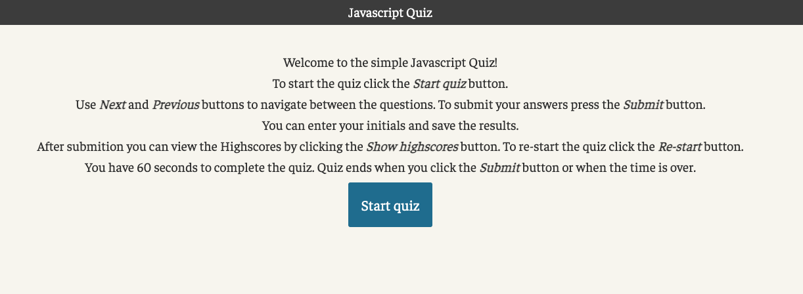
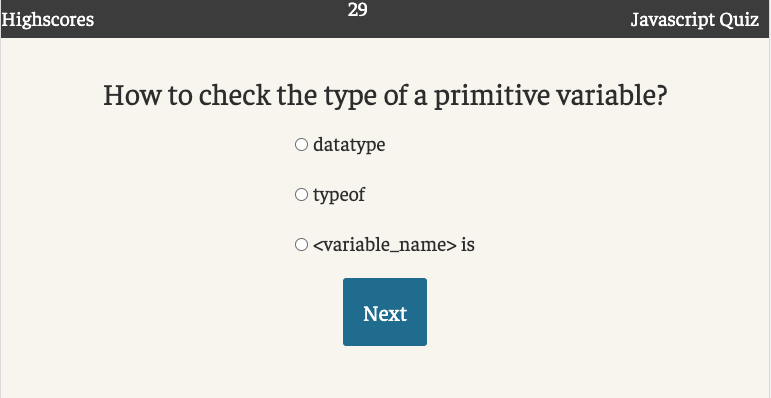
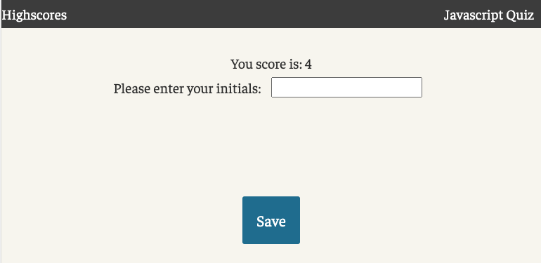

# JavaScript-Quiz

## The goal:
To develop an app that runs in the browser and features dynamically updated HTML and CSS powered by JavaScript code

Welcome to the simple Javascript Quiz!

To start the quiz click the **Start quiz** button. 
Use **Next** and **Previous** buttons to navigate between the questions. To submit your answers
press the **Submit** button.

You have 60 seconds to complete the quiz. Quiz ends when you click the **Submit** button or when the time is over.
You can enter your initials and save the results. After submission you can click the **Show highscores** button to see the sorted highscores or restart the quiz by clicking the **Start over** button.

On the "Highscores" page you re-start the quiz click the **Start over** button.

[Deployed web app](https://vasylynash.github.io/JavaScript-Quiz/)

